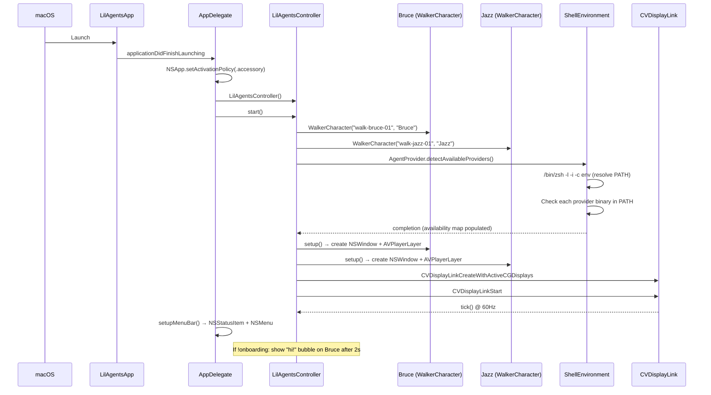
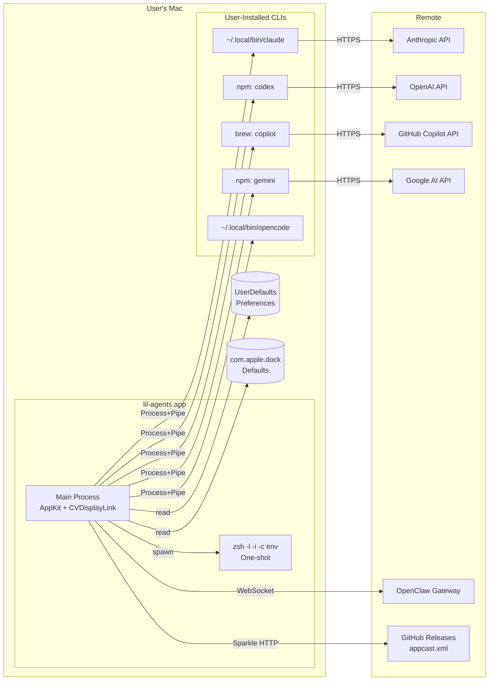

# filename: 02-runtime-architecture.md

# Runtime Architecture

## Process Model

lil-agents runs as a **single macOS agent process** (`LSUIElement=true`) with no Dock icon and no main window. It creates:

1. **The main process** — the SwiftUI/AppKit app, which owns:
   - A `CVDisplayLink` callback firing at display refresh rate (~60–120 Hz)
   - 2+ borderless `NSWindow` instances (one per character) at `statusBar` level
   - 0–1 popover `NSWindow` per character at `statusBar + 10` level
   - 0–1 thinking bubble `NSWindow` per character at `statusBar + 5` level
   - 1 debug line `NSWindow` at `statusBar + 10` (hidden by default)
   - 1 `NSStatusItem` for the menu bar icon
2. **Shell environment probe** — a one-shot `/bin/zsh -l -i -c env` process spawned on first need, cached thereafter
3. **AI CLI subprocesses** — one `Process` per active session:
   - `ClaudeSession`: single long-lived process (`claude -p --output-format stream-json ...`)
   - `CodexSession`: new process per turn (`codex exec --json ...`)
   - `CopilotSession`: new process per turn (`copilot -p ...`)
   - `GeminiSession`: new process per turn (`gemini --yolo -p ...`)
   - `OpenCodeSession`: new process per turn (`opencode run ...`)
   - `OpenClawSession`: **no subprocess** — uses `URLSessionWebSocketTask`

## CLI Binary Discovery

```
ShellEnvironment.findBinary(name:fallbackPaths:completion:)
    ├── ShellEnvironment.resolve() → /bin/zsh -l -i -c env → parse PATH
    ├── Search each PATH directory for executable binary
    └── If not found, check fallbackPaths:
        ├── ~/.local/bin/<name>
        ├── ~/.claude/local/bin/<name>   (Claude only)
        ├── ~/.npm-global/bin/<name>     (Codex, Copilot, Gemini)
        ├── /usr/local/bin/<name>
        └── /opt/homebrew/bin/<name>
```

Binary paths are **cached as static class properties** on each session class (e.g., `ClaudeSession.binaryPath`). This means the path is resolved once per app launch and never re-checked.

## Session Launch and Management

| Provider | Lifecycle | Process Strategy | Input Method |
|---|---|---|---|
| Claude | Long-running | Single `Process`, stdin/stdout pipes | JSON over stdin pipe |
| Codex | Per-turn | New `Process` per `send()`, prompt as CLI arg | Prompt string as argv |
| Copilot | Per-turn | New `Process` per `send()`, message as CLI arg | `-p <message>` argv |
| Gemini | Per-turn | New `Process` per `send()`, message as CLI arg | `-p <message>` argv |
| OpenCode | Per-turn | New `Process` per `send()`, message as CLI arg | `run <message>` argv |
| OpenClaw | Persistent WebSocket | `URLSessionWebSocketTask` | JSON over WebSocket |

## Streaming Output Handling

All CLI-based sessions use the same pattern:

```swift
outPipe.fileHandleForReading.readabilityHandler = { handle in
    let data = handle.availableData
    guard !data.isEmpty else { return }
    if let text = String(data: data, encoding: .utf8) {
        DispatchQueue.main.async {
            self.processOutput(text)  // buffers lines, parses NDJSON
        }
    }
}
```

Each session maintains a `lineBuffer: String` that accumulates partial reads and splits on `\n` boundaries. Each complete line is parsed as JSON. Non-JSON lines are handled differently per provider (Gemini streams them as plain text; Copilot flips `useJsonOutput` to false).

## Dock Positioning

```swift
getDockIconArea(screenWidth:) -> (x: CGFloat, width: CGFloat)
    ├── Read UserDefaults(suiteName: "com.apple.dock")
    │   ├── tilesize → slot width = tilesize * 1.25
    │   ├── persistent-apps count
    │   ├── persistent-others count
    │   ├── show-recents → recent-apps count
    │   └── divider count (between sections)
    ├── Calculate: dockWidth = slotWidth * totalIcons + dividers * 12
    ├── Apply fudge factor: dockWidth *= 1.15
    └── Center: dockX = (screenWidth - dockWidth) / 2
```

**Limitation**: This only works for bottom-positioned Docks. The code does not read the `orientation` key from Dock preferences, though `DockVisibility` correctly detects left/right Docks via frame comparison.

## Window Layering

```
NSWindow.Level hierarchy:
  statusBar + 10  → popover windows, debug line
  statusBar + 5   → thinking bubble windows
  statusBar + i   → character windows (i = sorted index by x-position)
```

Characters are re-sorted by `positionProgress` every frame, and their window levels are updated accordingly. This ensures the character further right always renders on top — a simple but effective z-ordering scheme.

## Animation Loop

```
CVDisplayLink callback (display refresh rate)
    └── DispatchQueue.main.async { controller.tick() }
            ├── Determine activeScreen (dock screen or primary)
            ├── Check shouldShowCharacters() → hide/show all
            ├── getDockIconArea() → compute walk boundaries
            ├── For each visible character:
            │   ├── If idleForPopover → reposition, update popover, update bubble
            │   ├── If paused & timer expired → startWalk()
            │   ├── If walking → movementPosition(at:) → update positionProgress
            │   └── updateThinkingBubble()
            └── Sort characters by x-position, reassign window levels
```

The `movementPosition(at:)` function implements a trapezoidal velocity profile:
- **Idle** → acceleration ramp → **full speed** → deceleration ramp → **idle**
- Parameters (`accelStart`, `fullSpeedStart`, `decelStart`, `walkStop`) are set per-character to match the video's walk animation keyframes.

## Per-Character State

Each `WalkerCharacter` maintains ~40+ mutable properties including:
- Walk state: `isWalking`, `isPaused`, `goingRight`, `positionProgress`, `walkStartPos`, `walkEndPos`, `walkStartPixel`, `walkEndPixel`, `walkStartTime`, `pauseEndTime`
- Popover state: `isIdleForPopover`, `popoverWindow`, `terminalView`, `session`, `currentStreamingText`
- Bubble state: `showingCompletion`, `currentPhrase`, `completionBubbleExpiry`, `lastPhraseUpdate`, `phraseAnimating`
- Visibility state: `isManuallyVisible`, `environmentHiddenAt`, `wasPopoverVisibleBeforeEnvironmentHide`
- Config: `provider`, `size`, `videoName`, `name`, `characterColor`, animation timing parameters

**There is no state machine.** Transitions are implicit in the `update()` method and `handleClick()`.

## Provider Switching

```
User selects new provider (menu bar or popover title dropdown)
    ├── Set char.provider = newProvider (persists to UserDefaults)
    ├── char.session?.terminate()
    ├── char.session = nil
    ├── Destroy popover window + terminal view
    ├── Destroy thinking bubble window
    └── If triggered from popover: call openPopover() which creates new session
```

## Local Storage

| Key | Type | Purpose | File |
|---|---|---|---|
| `"{name}Provider"` | String | Per-character provider selection | `WalkerCharacter.swift` |
| `"{name}Size"` | String | Per-character size | `WalkerCharacter.swift` |
| `"selectedProvider"` | String | Global provider (used as fallback) | `AgentSession.swift` |
| `"selectedThemeName"` | String | Active theme name | `PopoverTheme.swift` |
| `"hasCompletedOnboarding"` | Bool | First-run flag | `LilAgentsController.swift` |
| `"openClawGatewayURL"` | String | OpenClaw WebSocket URL | `OpenClawSession.swift` |
| `"openClawAuthToken"` | String | OpenClaw auth token | `OpenClawSession.swift` |
| `"openClawSessionPrefix"` | String | OpenClaw session prefix | `OpenClawSession.swift` |
| `"openClawAgentId"` | String? | OpenClaw agent routing | `OpenClawSession.swift` |
| `"openClawDeviceIdentity"` | Data | Ed25519 private key (JSON) | `OpenClawSession.swift` |

## What Is Local vs External

| Aspect | Local | External |
|---|---|---|
| Character animation | Bundled `.mov` files | — |
| Sounds | Bundled `.mp3`/`.m4a` files | — |
| Dock geometry | Read from local `com.apple.dock` defaults | — |
| Theme definitions | Hardcoded in `PopoverTheme.swift` | — |
| CLI binaries | Must be pre-installed by user | — |
| AI inference | — | Handled entirely by the CLI/API |
| Update feed | — | `appcast.xml` on GitHub |
| OpenClaw gateway | — | Self-hosted WebSocket server |

---

## Mermaid Diagrams

### Sequence Diagram — App Startup



### Component Diagram

```mermaid
graph TB
    subgraph "macOS Process"
        App[LilAgentsApp<br>@main SwiftUI App]
        AD[AppDelegate<br>NSApplicationDelegate]
        Ctrl[LilAgentsController<br>CVDisplayLink tick loop]
        
        subgraph "Per Character"
            WC[WalkerCharacter<br>State + Animation + Session]
            CCV[CharacterContentView<br>Hit-testing NSView]
            TV[TerminalView<br>Chat rendering]
            PT[PopoverTheme<br>Style definitions]
        end
        
        subgraph "Session Layer"
            AS[AgentSession protocol]
            CS[ClaudeSession]
            CDS[CodexSession]
            CPS[CopilotSession]
            GS[GeminiSession]
            OCS[OpenCodeSession]
            OWS[OpenClawSession]
        end
        
        SE[ShellEnvironment<br>PATH resolver]
        DV[DockVisibility<br>Screen detection]
    end
    
    subgraph "External"
        CLI1[claude CLI]
        CLI2[codex CLI]
        CLI3[copilot CLI]
        CLI4[gemini CLI]
        CLI5[opencode CLI]
        WS[OpenClaw Gateway<br>WebSocket]
        SPK[Sparkle Update Feed]
    end
    
    App --> AD
    AD --> Ctrl
    Ctrl --> WC
    WC --> CCV
    WC --> TV
    WC --> AS
    TV --> PT
    AS --> CS & CDS & CPS & GS & OCS & OWS
    CS & CDS & CPS & GS & OCS --> SE
    CS -.->|Process+Pipe| CLI1
    CDS -.->|Process+Pipe| CLI2
    CPS -.->|Process+Pipe| CLI3
    GS -.->|Process+Pipe| CLI4
    OCS -.->|Process+Pipe| CLI5
    OWS -.->|URLSession| WS
    Ctrl --> DV
    AD -.-> SPK
```

### Deployment Diagram


