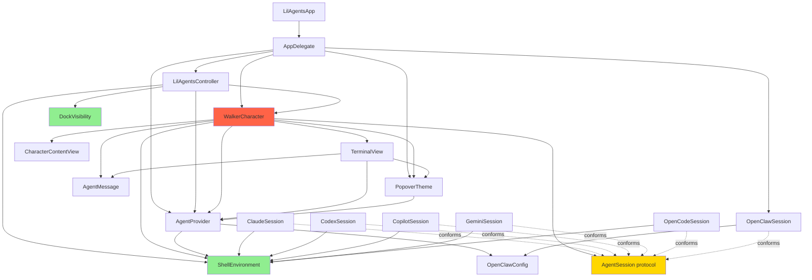

# filename: 06-dependency-config-packaging.md

# Dependency Map, Configuration, Persistence, and Packaging

## Code-Level Dependency Map

### Import Graph

```
LilAgentsApp.swift
    imports: SwiftUI, AppKit, Sparkle
    uses: AppDelegate, LilAgentsController, WalkerCharacter, AgentProvider,
          PopoverTheme, CharacterSize, OpenClawSession

LilAgentsController.swift
    imports: AppKit
    uses: WalkerCharacter, AgentProvider, ShellEnvironment, DockVisibility

WalkerCharacter.swift
    imports: AVFoundation, AppKit
    uses: AgentProvider, AgentSession, AgentMessage, PopoverTheme,
          CharacterSize, TerminalView, ShellEnvironment, KeyableWindow,
          CharacterContentView

AgentSession.swift
    imports: Foundation
    uses: ShellEnvironment, OpenClawConfig (defined in OpenClawSession.swift)
    defines: AgentProvider, AgentSession, AgentMessage, TitleFormat

ClaudeSession.swift
    imports: Foundation
    uses: AgentSession, AgentMessage, AgentProvider, ShellEnvironment

CodexSession.swift
    imports: Foundation
    uses: AgentSession, AgentMessage, AgentProvider, ShellEnvironment

CopilotSession.swift
    imports: Foundation
    uses: AgentSession, AgentMessage, AgentProvider, ShellEnvironment

GeminiSession.swift
    imports: Foundation
    uses: AgentSession, AgentMessage, AgentProvider, ShellEnvironment

OpenCodeSession.swift
    imports: Foundation
    uses: AgentSession, AgentMessage, AgentProvider, ShellEnvironment

OpenClawSession.swift
    imports: AppKit, CryptoKit, Foundation
    uses: AgentSession, AgentMessage, AgentProvider
    defines: OpenClawConfig, DeviceIdentity (private)

ShellEnvironment.swift
    imports: Foundation
    uses: (none — leaf dependency)

TerminalView.swift
    imports: AppKit
    uses: PopoverTheme, AgentProvider, AgentMessage

PopoverTheme.swift
    imports: AppKit
    uses: TitleFormat, AgentProvider (for titleString)

DockVisibility.swift
    imports: CoreGraphics
    uses: (none — leaf dependency)

CharacterContentView.swift
    imports: AppKit
    uses: WalkerCharacter, KeyableWindow (defined in same file)
```

### Mermaid Dependency Graph



Legend:
- 🟢 Green = Leaf dependencies (no coupling)
- 🟡 Yellow = Core abstraction
- 🔴 Red = God object / highest coupling

### Layered Architecture

```
┌─────────────────────────────────────────────────┐
│  App Layer (LilAgentsApp, AppDelegate)           │
│  - Entrypoint, menu bar, Sparkle                 │
├─────────────────────────────────────────────────┤
│  Orchestration Layer (LilAgentsController)       │
│  - CVDisplayLink, dock geometry, screen mgmt     │
├─────────────────────────────────────────────────┤
│  Character Layer (WalkerCharacter) ⚠️ GOD OBJECT│
│  - Animation, popover, session, bubbles, sounds  │
├────────────────────┬────────────────────────────┤
│  UI Layer          │  Session Layer              │
│  - TerminalView    │  - AgentSession (protocol)  │
│  - PopoverTheme    │  - ClaudeSession            │
│  - ContentView     │  - CodexSession             │
│                    │  - CopilotSession            │
│                    │  - GeminiSession             │
│                    │  - OpenCodeSession           │
│                    │  - OpenClawSession           │
├────────────────────┴────────────────────────────┤
│  Infrastructure Layer                            │
│  - ShellEnvironment (PATH resolution)            │
│  - DockVisibility (screen detection)             │
└─────────────────────────────────────────────────┘
```

### Tight Coupling Issues

1. **WalkerCharacter ↔ everything** — imports and uses nearly every other type. It cannot be tested, reused, or replaced independently.
2. **AgentProvider ↔ OpenClawConfig** — the provider enum directly references OpenClaw's config struct for availability checking.
3. **AppDelegate ↔ WalkerCharacter** — menu actions directly mutate character properties (`char.provider`, `char.size`, `char.session`).
4. **PopoverTheme ↔ AgentProvider** — themes need the provider for title string formatting.

### Hidden Global State

| Global | Type | Location | Impact |
|---|---|---|---|
| `ShellEnvironment.cachedEnvironment` | Static `[String: String]?` | `ShellEnvironment.swift` | Cached once, never invalidated. If user modifies PATH, app must restart. |
| `ClaudeSession.binaryPath` (and all sessions) | Static `String?` | Each session file | Binary path cached forever. Stale if CLI is moved/updated. |
| `AgentProvider.availability` | Static `[AgentProvider: Bool]` | `AgentSession.swift` | Populated once at startup. Never refreshed. |
| `PopoverTheme.customFontName` | Static `String?` | `PopoverTheme.swift` | Global, not persisted, hardcoded to `.AppleSystemUIFontRounded`. |
| `PopoverTheme.customFontSize` | Static `CGFloat` | `PopoverTheme.swift` | Global, not persisted, hardcoded to 13. |
| `WalkerCharacter.soundsEnabled` | Static `Bool` | `WalkerCharacter.swift` | Global, not persisted, resets to true on restart. |
| `WalkerCharacter.lastSoundIndex` | Static `Int` | `WalkerCharacter.swift` | Global, prevents consecutive same sound. |

### Does Current Structure Support Modular Growth?

**No.** The main barriers are:

1. `WalkerCharacter` merges 5+ concerns into one class — you cannot change the session layer without touching animation code.
2. Characters are hardcoded — adding a third character requires modifying `LilAgentsController.start()` and `AppDelegate` menu code.
3. Themes are hardcoded — adding a theme requires modifying `PopoverTheme.allThemes`.
4. No dependency injection — everything is created inline via constructors.
5. No module boundaries — all files are in a single flat directory with no package/module structure.

---

## Environment Variables

### Referenced in Code

| Variable | Used In | Required | Purpose | Actually Used at Runtime |
|---|---|---|---|---|
| `PATH` | `ShellEnvironment.swift` | Yes | Discover CLI binaries | ✅ Read from login shell env |
| `TERM` | `ShellEnvironment.swift` | Set | Set to `"dumb"` for spawned processes | ✅ Written |
| `CLAUDECODE` | `ShellEnvironment.swift` | No | Removed to prevent nested session detection | ✅ Removed |
| `CLAUDE_CODE_ENTRYPOINT` | `ShellEnvironment.swift` | No | Removed to prevent nested session detection | ✅ Removed |
| `OPENCLAW_GATEWAY_URL` | `OpenClawSession.swift` | No | Fallback for gateway URL | ✅ Read |
| `CLAWDBOT_GATEWAY_URL` | `OpenClawSession.swift` | No | Legacy fallback for gateway URL | ✅ Read |
| `OPENCLAW_GATEWAY_TOKEN` | `OpenClawSession.swift` | No | Fallback for auth token | ✅ Read |
| `CLAWDBOT_GATEWAY_TOKEN` | `OpenClawSession.swift` | No | Legacy fallback for auth token | ✅ Read |

### Documented in README but NOT in Code

| Variable | Documented | In Code |
|---|---|---|
| (none) | — | — |

The README does not document any environment variables. The `OPENCLAW_*` variables are documented only in the settings panel hint text.

---

## UserDefaults Keys

| Key Pattern | Type | Set In | Read In | Purpose |
|---|---|---|---|---|
| `"{name}Provider"` | String | `WalkerCharacter.provider.set` | `WalkerCharacter.provider.get` | Per-character AI provider |
| `"{name}Size"` | String | `WalkerCharacter.size.set` | `WalkerCharacter.size.get` | Per-character display size |
| `"selectedProvider"` | String | `AgentProvider.current.set` | `AgentProvider.current.get` | Global provider (appears unused at runtime — not read by any UI code) |
| `"selectedThemeName"` | String | `PopoverTheme.current.set` | `PopoverTheme.current.get` | Active theme |
| `"hasCompletedOnboarding"` | Bool | `completeOnboarding()` | `start()` | First-run flag |
| `"openClawGatewayURL"` | String | `OpenClawConfig.save()` | `OpenClawConfig.load()` | OpenClaw WebSocket URL |
| `"openClawAuthToken"` | String | `OpenClawConfig.save()` | `OpenClawConfig.load()` | OpenClaw auth token |
| `"openClawSessionPrefix"` | String | `OpenClawConfig.save()` | `OpenClawConfig.load()` | OpenClaw session grouping |
| `"openClawAgentId"` | String? | `OpenClawConfig.save()` | `OpenClawConfig.load()` | OpenClaw agent routing |
| `"openClawDeviceIdentity"` | Data | `DeviceIdentity.loadOrCreate()` | `DeviceIdentity.loadOrCreate()` | Ed25519 private key (JSON-encoded base64) |

### Dead Config

- **`"selectedProvider"` (`AgentProvider.current`)** — This key is defined with a getter/setter but is never actually used by any UI code. The menu bar action `switchProvider` sets each `char.provider` individually. `AgentProvider.current` is only read in `AppDelegate.openGatewaySettings()` to check if OpenClaw is active. This is vestigial from an earlier version where provider selection was global.

---

## Sparkle Update System

| Config Key | Value | Source |
|---|---|---|
| `SUFeedURL` | `https://raw.githubusercontent.com/ryanstephen/lil-agents/main/appcast.xml` | `Info.plist` |
| `SUPublicEDKey` | `8QOCrY3j4crgz4iR5lmxyv+rA5vnqK6Qtd1XheMllP8=` | `Info.plist` |
| `SUEnableAutomaticChecks` | `true` | `Info.plist` |
| `SUAllowsAutomaticUpdates` | `true` | `Info.plist` |

**Note**: The feed URL points to `ryanstephen/lil-agents`, not `itsnothuy/lil-agents`. If this is a fork, the Sparkle feed may still point to the upstream repo. This could mean auto-updates pull from the wrong source.

---

## Xcode / Build Setup

- **Project type**: Native Xcode project (`.xcodeproj`), not SPM-only
- **Dependencies**: Sparkle via Swift Package Manager (`Package.resolved`)
- **Build system**: Xcode default (no custom build phases visible in repo)
- **Deployment target**: macOS 14.0 (Sonoma)
- **Architecture**: Universal binary (arm64 + x86_64 per appcast v1.2.1)
- **Signing**: Not visible in repo (`.xcodeproj` would contain signing config)
- **Sandbox**: Disabled (`com.apple.security.app-sandbox = false`)
- **Entitlements**: Only the sandbox key

---

## Test Structure

| File | Framework | Tests | Coverage |
|---|---|---|---|
| `Tests/DockVisibilityTests.swift` | Custom (`expect()` + `exit(1)`) | 6 assertions | `DockVisibility` only |
| `Tests/main.swift` | Manual runner | Calls `runDockVisibilityTests()` | — |

**No XCTest, no XCUITest, no Quick/Nimble, no testing for:**
- Session protocol conformance
- NDJSON parsing correctness
- Theme construction
- Dock geometry calculation
- Shell environment resolution
- Markdown rendering
- Slash command handling

---

## Developer Workflow

1. Open `lil-agents.xcodeproj` in Xcode
2. Select `LilAgents` scheme
3. Build & Run (⌘R)
4. App appears as menu bar icon + characters on Dock
5. No command-line build support documented
6. No linting configured
7. No formatting configured
8. No pre-commit hooks
9. Tests run as a separate executable target, not integrated with Xcode test runner

---

## Mismatches Between README, CLAUDE.md, and Code

| Item | README | CLAUDE.md | Code | Mismatch? |
|---|---|---|---|---|
| Provider count | 4 (Claude, Codex, Copilot, Gemini) | 6 mentioned indirectly | 6 (adds OpenCode, OpenClaw) | ✅ README outdated |
| Characters | "Bruce and Jazz" | "Per-character provider/size" | Bruce and Jazz hardcoded | Consistent |
| Build | "Open in Xcode and hit run" | "Open in Xcode, build LilAgents scheme" | Xcode project | Consistent |
| CLI install | Lists 4 CLIs | Doesn't list installs | 6 providers | CLAUDE.md doesn't list OpenCode/OpenClaw installs |
| Privacy | "No analytics" | Not mentioned | Sparkle sends version info | Technically consistent (Sparkle is update check, not analytics) |
| `bruce-hang` asset | Not mentioned | Not mentioned | In asset catalog | Unused/legacy asset |
